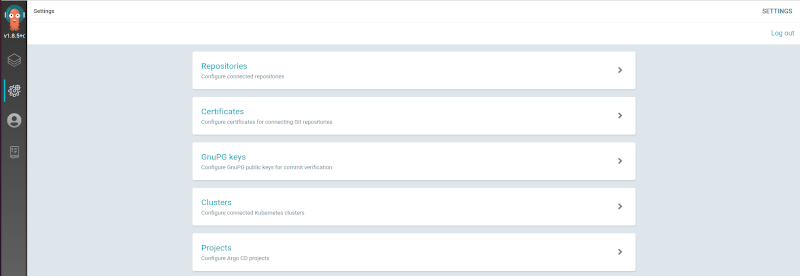
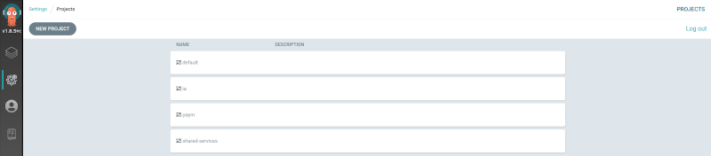
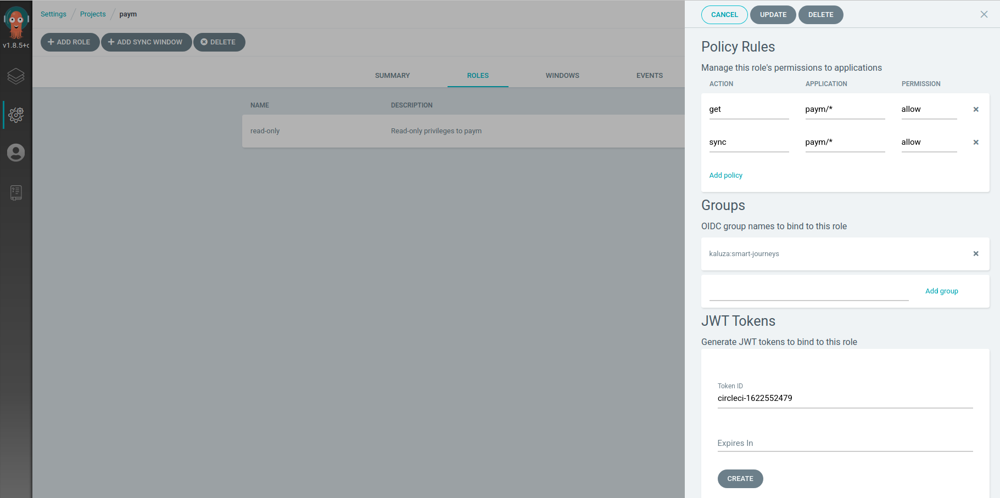

# ArgoCD Deploy Orb

Interacts with an ArgoCD API (currently only provides ability to wait for ArgoCD to be in sync)

## Prerequisites

You will need to use a context with `ARGOCD_TOKEN` populated with a token from the project your application resides in. See below on how to generate a token. This token can be re-used amongst all applications in your team's project; the role used should only provide read-only access to your project and its applications.

## Example Usage

### Wait for sync

The `target` must be the commmit hash you expect ArgoCD to sync with.

```yaml
orbs:
  argocd: ovotech/argocd@0.1.0

jobs:
  deploy-to-uat:
    executor: python
    context: jaws-nonprod # Must have ARGOCD_TOKEN in the context
    steps:
    - gitops-deploy # Deploys to manifest repo, persists deployed commit hash as ARGO_TARGET_REVISION in $BASH_ENV
    - argocd/wait_for_sync:
        application: journey-meter-tariff-extractor
        argocd_url: https://argocd.metering-shared-non-prod.ovotech.org.uk/
        target: $ARGO_TARGET_REVISION
    - run-test
```

## Generating a token

This assumes you have an existing role associated with your project. This should just need read access.

In ArgoCD UI go to *Settings*


Click *Projects* and select your project name (i.e. your team name). 




On the *Roles* table, select the desire role and create a JWT token at the bottom.



**Important:** Give the token a name that indicates its purpose but it must be unique within your project: if you create a token with the same name as a previously deleted one, the deleted token will be considered valid (unless expired). A token ID of the form `circle-<unix timestamp>` is recommended.

When created the token will appear at the bottom of the right-hand panel (you will have to scroll to see it). Copy the token; it will not be shown again.
