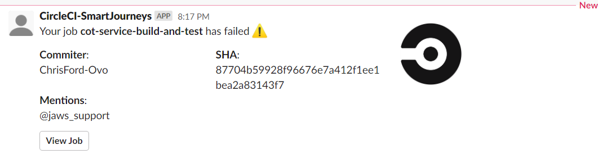

# Smart Journeys (JAWS) Standard CircleCI Deployment

This orb provides a standard deployment process for all journey repositories to ensure common code between them.

### Making Updates
To update this orb, simply make the required changes, and then increment the version number in the orb_version.txt file

### Jobs

Available Jobs
* [checkout-code](#checkout-code)
* [build-and-test](#build-and-test)
* [integration-test](#integration-test)
* [avro](#avro)
* [synk-scan](#synk-scan)
* [tf-plan](#tf-plan)
* [tf-apply](#tf-apply)
* [tf-plan-java](#tf-plan-java)
* [tf-apply-java](#tf-apply-java)
* [notify-shipit](#notify-shipit)
* [run-automation-test](#run-automation-test)
* [create-release](#create-release)
* [install-npm-dependencies](#install-npm-dependencies)
* [bundle-swagger-doc](#bundle-swagger-doc)

All the available jobs apart from checkout-code will notify of failure via a slack message.  For more info go to [slack-notification](#slack-notification) section.

### checkout-code

**Description**

This circleci job checks out your repositories code, and persists it to a working directory

**Parameters**

Does not require any parameters to be provided

### avro

**Description**

This job performs two steps for the journey code bases.  
 1. Firstly it checks whether the version of the schema that the code would produce is compatible with the version of the schema currently in Aiven, 
 2. Uploads the schema to Aiven's schema registry. This feature is optional and can be switched off with `uploadschema` parameter

**Note** If you are not uploading the schema then the compatibility check will handle instances of the schema not being found in the schema registry.  This is to allow for testing without having to commit the schema 

**Parameters**

* uploadschema: Boolean value expected, which indicates whether you want to run the upload avro step.  Default value is false
* environment: Indicates to the build step which properties file to run against.  Expected values are `[sandbox, nonprod, prod]`

### build-and-test

**Description**

This job performs a few steps
1. Runs a gradle build on the service provided in `serviceName` parameter
2. Run unit tests
3. Saves the results of the unit tests to be used for code coverage
4. Publishes docker image to AWS ECR - if `publish` parameter is set to true

**Parameters**

* serviceName: Which service within the repo are you wanting to build
* environment: Indicates to the build step which properties file to run against.  Expected values are `[sandbox, nonprod, prod]`
* publish: Indicates whether you want to upload the resulting Docker image to AWS ECR
* skipUnitTests: If set to true, will run gradle with `-x test`

### lib-build-and-test

**Description**

This job will build the provided lib project, the reason for this step is to allow Code Coverage to report on tests within libs.  It runs exactly the same steps as [build-and-test](#build-and-test)
**Parameters**
* lib: The name of the lib project to be built
* contains_integration_tests: flag indicating whether the lib contains a gradle integration test task (defaulted to true)
* command: determine whether you want to run gradle build or publish commands (default is build)

### integration-test

**Description**

This job executes integration tests for the supplied service

**Parameters**

* serviceName: Which service within the repo are you wanting to build
* environment: Indicates to the build step which properties file to run against.  Expected values are `[sandbox, nonprod, prod]`

### run-automation-test

**Description**


**Parameters**

* `environment` - indicates to the build step which properties file to run against.  Expected values are [sandbox, nonprod, prod]

### synk-scan

Performs a check to make sure your code dependencies do not introduce any new security vulnerabilities 

**Parameters**

Does not require any parameters passed through.

**CircleCI Environment Variables**
* SNYK_TOKEN: API Token used to communicate with Snyk

### tf-plan
**Description**

This step performs a linting step to make sure the terraform styling is in a standardised format, and then runs a terraform plan - based on the files provided in the path parameter.

**Parameters**
* attach_workspace: Boolean field to indicate whether you want to attach to the workspace 'working'.  This is defaulted to false, and is only used for the template build.
* path: The path of the terraform files you are wanting to run against - **Note** remember to omit the root terraform directory from your path.  As shown in the hierarchy example below Journeys will typically contain a main and kubernetes subfolder.
* environment: Indicates which environment the code is being deployed to.  Expected values are `[sandbox, nonprod, prod]`

```
terraform
└───kubernetes
│   │   kubernetes1.tf
│   │   kubernetes2.tf
│   │
│   └───modules
│       │   exmaple3.tf
│       │   example4.tf
│       │   ...
│   
└───main
    │   service1.tf
    │   service2.tf
```

### tf-apply

**Description**

This step performs a linting step to make sure the terraform styling is standardised, and then runs a terraform apply - based on the files provided in the path parameter.

**Parameters**
* attach_workspace: Boolean field to indicate whether you want to attach to the workspace 'working'.  This is defaulted to false, and is only used for the template build.
* path: The path of the terraform files you are wanting to run against - **Note** remember to omit the root terraform directory from your path.  As shown in the hierarchy example below Journeys will typically contain a main and kubernetes subfolder.
* environment: Indicates which environment the code is being deployed to.  Expected values are `[sandbox, nonprod, prod]`

### tf-plan-java
**Description**

This step is the same as [tf-plan](#tf-plan) but installs adoptopenjdk in order to allow java keystore and truststore to be created.

### tf-apply-java
**Description**

This step is the same as [tf-apply](#tf-apply) but installs adoptopenjdk in order to allow java keystore and truststore to be created.

### notify-shipit

**Description**

Send a message to shipit API to indicate when a deployment has occurred

**Parameters**

Does not require any parameters passed through.  However it does require that you provide a SHIPIT_API_KEY within the project environment variables or context

### report-code-coverage
**Description**

This step generates a code coverage report and adds to your GitHub PR as comments.  To generate the report, the step [build-and-test](#build-and-test) need to of already completed.
 
**Parameters**

Does not require any parameters to be passed.  It does however need the following environment variables to be set `GITHUB_BOT_USERNAME` and `GITHUB_BOT_PACKAGE_MANAGER_TOKEN`

### Slack Notification
**Description**
This step will send a slack notification when a build step fails.  This is to increase visibility of failures to the development team.

These are configured in CircleCI contexts - described below.

To run the slack notification we implemented the steps in the [developers setup guide](https://github.com/CircleCI-Public/slack-orb/wiki/Setup#4-create-a-context-on-circleci).  For CircleCi you just need to make sure you are passing the following environment variables
- SLACK_ACCESS_TOKEN
- SLACK_DEFAULT_CHANNEL - to get the channel Id it is easier to open slack in a web browser as you can see the channel Id in the url  
- SLACK_INTEGRATION_ENABLED - toggle whether to run slack notification steps (true/false)

### create-release
**Description**
This step implements [semantic release](https://semantic-release.gitbook.io/semantic-release/) to automatically create the following
* Github Release tag
* Release notes
* ChangeLog
To automatically create these you need to follow [conventional commits](https://www.conventionalcommits.org/en/v1.0.0/).

### install-npm-dependencies
**Description**

Installs node packages and stores the node_modules in the cache under npm-build-dependencies-cache-({checksum "package-lock.json"}) key.

### bundle-swagger-doc
**Description**

Restores the node_modules from the cache and runs build to store the generated docs.

#### Example notification


## Example Usage
```yaml
version: 2.1
orbs:
  deploy-orb: ovotech/jaws-journey-deploy@dev:change_save_test_results

parameters:
  sandbox_build_branch:
    type: string
    default: feat/test
  run_integration_tests:
    type: boolean
    default: true

aliases:
  - &ignore-master-branch
    branches:
      ignore:
        - master

  - &any-cd-pipeline
    filters:
      branches:
        only:
          - master
          - << pipeline.parameters.sandbox_build_branch >>
      tags:
        only: /^\d+\.\d+\.\d+$/

  - &nonprod-job
    context: jaws-nonprod
    filters:
      branches:
        only: master

  - &prod-job
    context: jaws-prod
    filters:
      branches:
        ignore: /.*/
      tags:
        only: /^\d+\.\d+\.\d+$/

  - &ci-build
    context: jaws-sandbox
    filters:
      branches:
        ignore:
          - master
          - << pipeline.parameters.sandbox_build_branch >>

  - &deploy-sandbox
    context: jaws-sandbox
    filters:
      branches:
        only: << pipeline.parameters.sandbox_build_branch >>

  - &all-services-matrix
    parameters:
      serviceName:
        - meter-appointment-preference-service
        - meter-bol-request-result-service
        - meter-commission-service
        - meter-install-default-tariff-service
        - meter-receive-installed-service
        - meter-receive-tariff-configuration-service
        - meter-send-billing-service
        - meter-send-install-service
        - meter-tariff-service-v2
        - receive-billing-schedule-service
        - replay-service
        - e2e-test-data-generator-service

  - &all-lib-matrix
    matrix:
      alias:
        build-and-test-lib
      parameters:
        lib:
          - avro-common
          - bol-stash-lib
          - journey-tracker-lib
          - meter-tariff-lib

  - &integration-test-services-matrix
    matrix:
      alias:
        integration-test
      parameters:
        serviceName:
          - meter-appointment-preference-service
          - meter-bol-request-result-service
          - meter-commission-service
          - meter-install-default-tariff-service
          - meter-receive-tariff-configuration-service
          - receive-billing-schedule-service

workflows:
  ci:
    jobs:
      - deploy-orb/checkout-code:
          filters: *ignore-master-branch
          name: checkout-code
      - deploy-orb/snyk-scan:
          name: snyk-scan
          <<: *ci-build
          requires:
            - checkout-code
      - deploy-orb/avro:
          name: avro-ci
          <<: *ci-build
          environment: sandbox
          requires:
            - checkout-code
      - deploy-orb/build-and-test:
          <<: *ci-build
          name: << matrix.serviceName >>-build-and-test
          matrix:
            alias:
              build-and-test-sandbox
            <<: *all-services-matrix
          environment: sandbox
          serviceName: << matrix.serviceName >>
          requires:
            - checkout-code

      - deploy-orb/lib-build-and-test:
          <<: *ci-build
          <<: *all-lib-matrix
          name: << matrix.lib >>-build-and-test-lib
          lib: << matrix.lib >>
          requires:
            - checkout-code

      - deploy-orb/integration-test:
          name: integration-test-<< matrix.serviceName >>
          environment: sandbox
          <<: *integration-test-services-matrix
          <<: *ci-build
          requires:
            - checkout-code

      - deploy-orb/tf-plan:
          <<: *ci-build
          name: tf-plan-<< matrix.path >>-<< matrix.environment >>
          matrix:
            parameters:
              path:
                - ''
                - kubernetes
              environment:
                - sandbox
          requires:
            - checkout-code

      - deploy-orb/report-code-coverage:
          <<: *ci-build
          name: report-code-coverage
          requires:
            - build-and-test-sandbox
            - build-and-test-lib
  
  e2e-test:
      jobs:
        - hold-e2e-tests:
            type: approval
  
        - deploy-orb/checkout-code:
            <<: *e2e-test-job
            name: checkout-code-e2e-tests
            requires:
              - hold-e2e-tests
  
        - deploy-orb/build-and-test:
            <<: *e2e-test-job
            name: << matrix.serviceName >>-build-and-publish
            matrix:
              alias:
                build-and-publish-e2e-test
              <<: *all-services-matrix
            environment: test
            serviceName: << matrix.serviceName >>
            publish: true
            skipUnitTests: true
            requires:
              - checkout-code-e2e-tests
              - tf-apply--test
  
        - deploy-orb/avro:
            <<: *e2e-test-job
            name: avro-cd-test
            environment: test
            uploadschema: true
            requires:
              - checkout-code-e2e-tests
              - tf-apply--test
  
        - deploy-orb/tf-apply:
            <<: *e2e-test-job
            name: tf-apply-<< matrix.path >>-test
            matrix:
              parameters:
                path:
                  - ''
                environment:
                  - test
            requires:
              - checkout-code-e2e-tests
  
        - deploy-orb/tf-apply:
            <<: *e2e-test-job
            name: tf-apply-<< matrix.path >>-<< matrix.environment >>
            matrix:
              parameters:
                path:
                  - kubernetes
                environment:
                  - test
            requires:
              - avro-cd-test
              - build-and-publish-e2e-test
              - tf-apply--test

  cd:
    jobs:
      - deploy-orb/checkout-code:
          name: checkout-code
          <<: *any-cd-pipeline

      - deploy-orb/tf-apply:
          <<: *deploy-sandbox
          name: tf-apply-<< matrix.path >>-<< matrix.environment >>
          matrix:
            parameters:
              path:
                - main
              environment:
                - sandbox
          requires:
            - checkout-code

      - deploy-orb/build-and-test:
          name: build-and-test-publish-<< matrix.serviceName >>
          environment: sandbox
          matrix:
            alias:
              build-and-test-publish-sandbox
            <<: *all-services-matrix
          <<: *deploy-sandbox
          publish: true
          requires:
            - checkout-code
      - deploy-orb/avro:
          <<: *deploy-sandbox
          name: avro-cd-sandbox
          environment: sandbox
          uploadschema: true
          requires:
            - checkout-code
      - deploy-orb/tf-apply:
          <<: *deploy-sandbox
          name: tf-apply-<< matrix.path >>-<< matrix.environment >>
          matrix:
            parameters:
              path:
                - kubernetes
              environment:
                - sandbox
          requires:
            - avro-cd-sandbox
            - build-and-test-publish-sandbox
            - tf-apply-main-sandbox

      - deploy-orb/run-automation-test:
          name: run-automation-test
          <<: *deploy-sandbox
          requires:
            - tf-apply-kubernetes-sandbox

      - deploy-orb/tf-apply:
          <<: *nonprod-job
          name: tf-apply-<< matrix.path >>-<< matrix.environment >>
          matrix:
            parameters:
              path:
                - main
              environment:
                - nonprod
          requires:
            - checkout-code

      - deploy-orb/build-and-test:
          name: build-and-test-publish-<< matrix.serviceName >>
          environment: nonprod
          matrix:
            alias:
              build-and-test-publish-nonprod
            <<: *all-services-matrix
          <<: *nonprod-job
          publish: true
          requires:
            - checkout-code
      - deploy-orb/avro:
          <<: *nonprod-job
          name: avro-cd-nonprod
          uploadschema: true
          environment: nonprod
          requires:
            - checkout-code

      - deploy-orb/tf-apply:
          <<: *nonprod-job
          name: tf-apply-<< matrix.path >>-<< matrix.environment >>
          matrix:
            alias:
              kubernetes-deployment-nonprod
            parameters:
              path:
                - kubernetes
              environment:
                - nonprod
          requires:
            - avro-cd-nonprod
            - build-and-test-publish-nonprod
            - tf-apply-main-nonprod

    - deploy-orb/create-release:
          <<: *nonprod-job
          name: create-release
          requires:
            - kubernetes-deployment-nonprod

      - deploy-orb/tf-apply:
          <<: *prod-job
          name: tf-apply-<< matrix.path >>-<< matrix.environment >>
          matrix:
            parameters:
              path:
                - main
              environment:
                - prod
          requires:
            - checkout-code
      - deploy-orb/build-and-test:
          name: build-and-test-publish-<< matrix.serviceName >>
          environment: prod
          matrix:
            alias:
              build-and-test-publish-prod
            <<: *all-services-matrix
          <<: *prod-job
          publish: true
          requires:
            - checkout-code
      - deploy-orb/avro:
          <<: *prod-job
          name: avro-upload-prod
          environment: prod
          uploadschema: true
          requires:
            - checkout-code
      - deploy-orb/tf-apply:
          <<: *prod-job
          name: tf-apply-<< matrix.path >>-<< matrix.environment >>
          matrix:
            parameters:
              path:
                - kubernetes
              environment:
                - prod
          requires:
            - avro-upload-prod
            - build-and-test-publish-prod
            - tf-apply-main-prod

      - deploy-orb/notify-shipit:
          name: notify-shipit
          <<: *prod-job
          requires:
            - tf-apply-kubernetes-prod
```